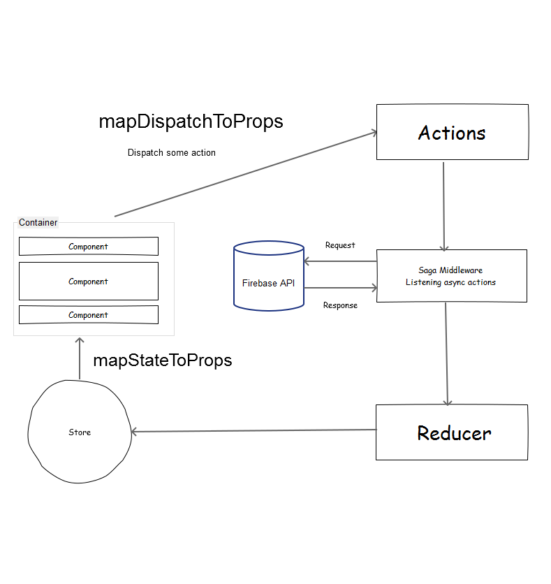

# ReactJS demo with blog CRUD #

以Create、Read、Update、Delete的流程搭配Firebas並使用Reactjs來實作，記錄過程中的目錄結構、非同步處理、相關流程、步驟，以供基礎專案參考

## <a href="https://weihanchen.github.io/reactjs-public-blog-firebase/public" target="_blank">Live Demo</a> ##

## Requirement ##
* [Nodejs 7.0.0+](https://nodejs.org/en/)
* [NPM 3.10.8+](https://www.npmjs.com/) - A package manager for build environment

## Quick Start ##
* git clone https://github.com/weihanchen/reactjs-public-blog-firebase.git
* cd reactjs-public-blog-firebase
* npm install
* npm run dev - development
* npm run build - build to public/bundle.js
* npm start - build and run

## Stack ##
>1. [React](https://facebook.github.io/react/)
>2. [Redux](https://github.com/reactjs/redux)
>3. [Redux Saga](https://github.com/yelouafi/redux-saga)
>4. [React Router](https://github.com/ReactTraining/react-router)
>5. [Firebase](https://firebase.google.com/) - database to store data
>6. [SASS、SCSS](http://sass-lang.com/)
>7. [Bootstrap](http://getbootstrap.com/)
>8. [Fontawesome](http://fontawesome.io/)

## Dependencies ##
* [react-html-parser](https://github.com/wrakky/react-html-parser)
* [React-Quill ](https://github.com/zenoamaro/react-quill)

## File Structure ##
	app - reactjs source code
	 |-actions
	 |-api - firebase services
	 |-components - ui view
	 	|-App
	 	|-Body
	 	|-Detail
	 	|-Editor
	 	|-ErrorContent
	 	|-Footer
	 	|-Header
	 	|-Posts
	 	|-SearchBar
	 	|-Spinner
	 |-containers - connect with redux\'s store and dispatch actions
	 	|-pages
	 		|-CreateContainer.js
	 		|-DetailContainer.js
	 		|-EditContainer.js
	 		|-HomeContainer.js
	 		|-index.js
	 |-reducers
	 |-sagas - middleware to process async actions
	 |-store
	 |-stylesheets - scss files
	 |-utils
	 |-client.js
	 |-routers.js
	public - running application folder

## Components ##

## Data Flow ##

## Design Step ##
>1. Components -> Actions -> Sagas -> Reducers -> Containers
>2. configureStore: Connect with reducers and sagas

## Todo ##
>1. add some test
>2. add branch for authentication
